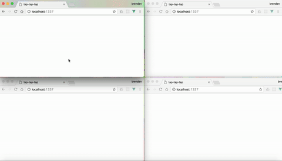

# ttt

This project is a small side project utilising various technologies together.

The technologies used in this small project are :
 * socket.io
 * vue.js
 * express

The idea is a clone from one of the projects floating around in the internet.

The idea is basically just a tappling application. Anyone who goes into the website is able to participate in the 'game'.

Users can tap a spot; this will generate a ripple effect; this ripple will then be sent to the server and the server will broadcast the event to the people connected to the application.

## Getting Started

Provide instructions here about how to get your project running on our local machine. Do we just need to clone and open a certain file or do we need to install anything first.

### Prerequisites

Nothing to set up; clone, npm install and run node app.js or npm run start!

Otherwise, this application will be hosted on a heroku platform after I finish writing up this readme.md

and the link is..... https://tap-tap-tap.herokuapp.com/

### How to Use

Just tap on the white page of the application!

## Tests

Nope I did not do any tests for this mini project.

## Live Version

Where is this deployed online (github pages, heroku etc), give us the link and any access details we need.

the website is hosted live @ this link : https://tap-tap-tap.herokuapp.com/

## Built With

What did you use to build it, list the technologies, plugins, gems, packages etc.

* Vue.js
* socket.io package
* express
* node

## Workflow

Workflow was me just thinking of the idea and hacking around with the socket io package.

## Authors

Just me

## Further Extensions

Further extensions would add a message to broadcast to all users that another user has connected.

Also, clicks could have different effects -> maybe perhaps circles clashing with each other to form a rainbow pattern.

## References and Acknowledgments:

* https://github.com/WaleedAmer/Tapfest
